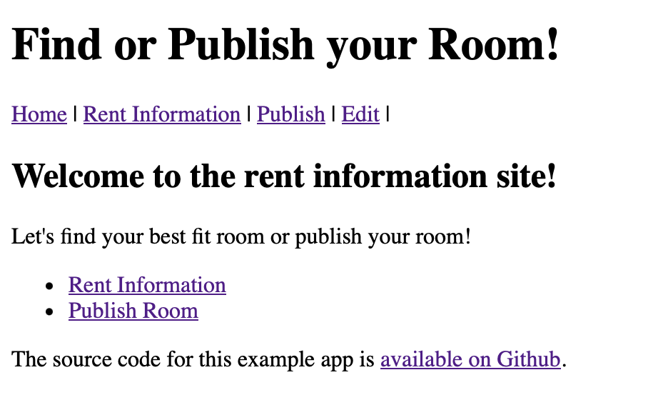
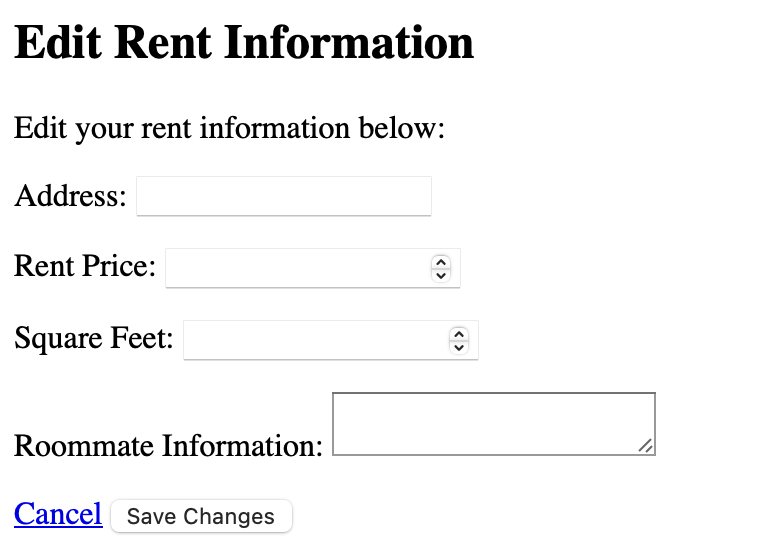
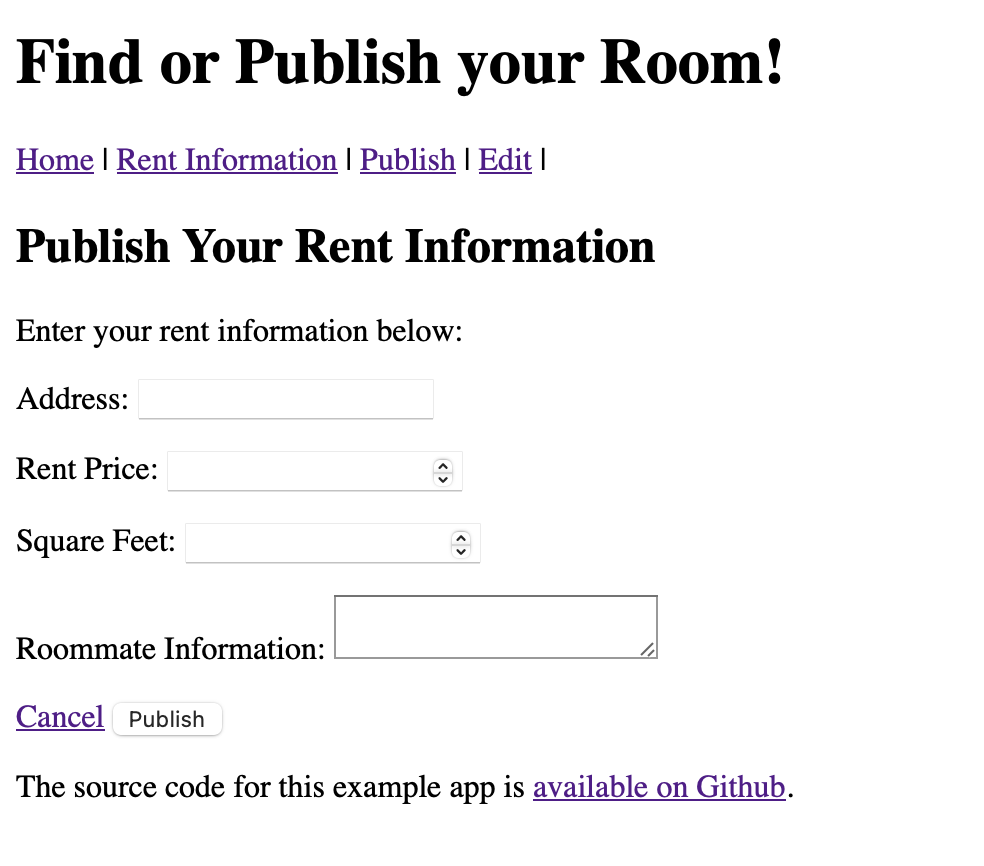
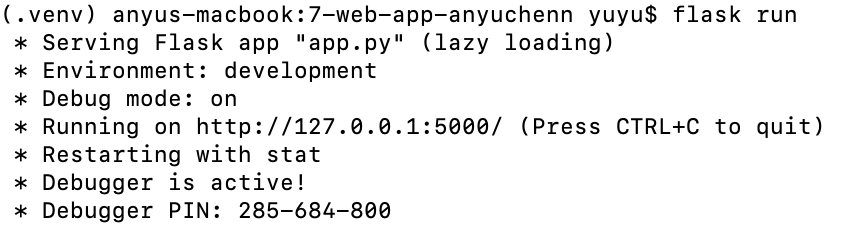

**Short Description:**
It is a platform designed to help individuals find or publish rooms for rent. Whether you're a tenant searching for your next living space or a landlord looking to advertise available rooms, it streamlines the process, connecting users seamlessly. It caters to a diverse range of users, including students, professionals, landlords, and anyone in need of rental accommodation. Whether you're seeking a cozy room in a shared apartment or managing multiple rental properties, it provides the tools you need.

**App Functionality:**

**Home Page:**

- The home page serves as the central hub of the web, welcoming users and providing easy access to essential features.
- Users can navigate to different sections of the app, including the read (rent information), create (publish a room), and edit pages.

**Edit Page:**

- The edit page allows users to modify existing rental information.
- Users can update details such as address, rent price, square footage, and roommate information.
- Upon submission, changes are reflected in the database, ensuring accurate and up-to-date listings.

**Create Page:**

- The create page enables landlords and users to publish new rental listings.
- Users can input essential details about the available room, including address, rent price, square footage, and additional information.
- Upon submission, the new listing is added to the database, making it visible to potential tenants browsing the platform.

With its intuitive interface and comprehensive features, it simplifies the process of finding or publishing rooms for rent, making it the go-to platform for individuals seeking accommodation solutions.

**Flask Run:**
